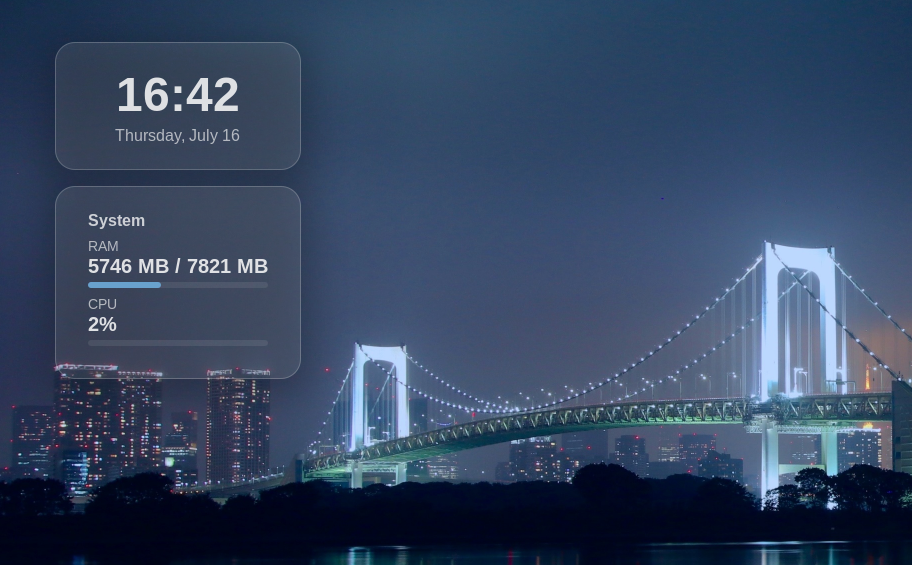

https://github.com/peter-njoro/glass-widgets

# Glass Widgets

by Peter Njoroge

Frosted glass desktop widgets for GNOME Shell — clock, system stats, and more.



## Features

- **Clock widget** — live clock with frosted glass styling
- **System stats widget** — RAM and CPU usage with progress bars
- Configurable position, opacity, and per-widget toggles
- Tier 1 CSS-only glassmorphism (no shader dependencies)

## Install

### From extensions.gnome.org

1. Visit [Glass Widgets on extensions.gnome.org](https://extensions.gnome.org/extension/XXXX/glass-widgets/)
2. Toggle on

### Manual

```bash
git clone https://github.com/peter-njoro/glass-widgets.git
cd glass-widgets
gnome-extensions pack --extra-source=widgets --extra-source=stylesheet.css
gnome-extensions install glass-widgets@desktop.shell-extension.zip
```

Then log out and back in, or restart GNOME Shell.

### Development

```bash
git clone https://github.com/peter-njoro/glass-widgets.git
ln -s $(pwd) ~/.local/share/gnome-shell/extensions/glass-widgets@peter-njoro.github.io
```

## License

GPL-3.0 — see [LICENSE](LICENSE).
