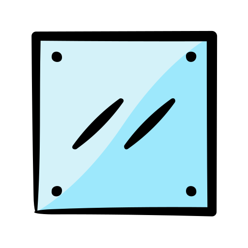
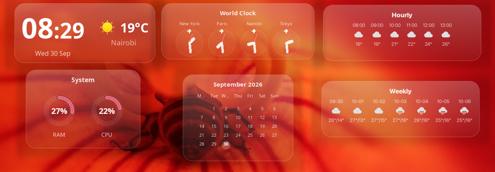
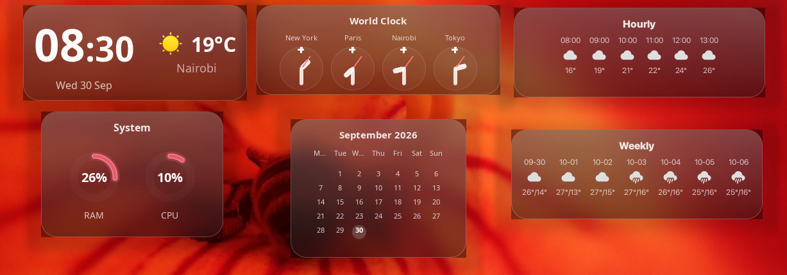

# Glass Widgets



<iframe src="https://github.com/sponsors/peter-njoro/button" title="Sponsor peter-njoro" height="32" width="114" style="border: 0; border-radius: 6px;"></iframe>

by Peter Njoroge
Frosted glass desktop widgets for GNOME Shell - clock, system stats, and more.

https://extensions.gnome.org/extension/10416/glass-widgets/

### clear

### blured


## Features

- **Clock widget** - live clock with frosted glass styling
- **System stats widget** - RAM and CPU usage with doughnut gauges
- **Weather** - current conditions plus optional hourly and seven-day forecasts, automatic or manual location, and Celsius/Fahrenheit units
- **Calendar widget** - current month view with today highlighted
- **World clock** - analog clocks for configurable timezones
- **Clock styling** - optional 12/24-hour format, font weight, size ratio, and color controls
- **Media player** - intentionally deferred; this feature will ship in a later release after D-Bus/AppArmor sandboxing issues are resolved
- Independent position controls, opacity, and visibility toggles for widgets
- Glass reflection sheen enabled by default, with optional blur effect
- Tier 1 CSS-only glassmorphism (no shader dependencies)
- Accent color aware - pipeline arcs follow the system accent color (pair it with [Auto Accent Colour](https://extensions.gnome.org/extension/7502/auto-accent-colour/) to sync it automatically with your wallpaper)

## Install

### From extensions.gnome.org

1. Visit [Glass Widgets on extensions.gnome.org](https://extensions.gnome.org/extension/10416/glass-widgets/)
2. Toggle on

### Manual

```bash
git clone https://github.com/peter-njoro/glass-widgets.git
cd glass-widgets
gnome-extensions pack --extra-source=widgets --extra-source=stylesheet.css
gnome-extensions install glass-widgets@peter-njoro.github.io.zip
```

Then log out and back in, or restart GNOME Shell.

## Notes

### Blur

The blur effect uses GNOME Shell's built-in `Shell.BlurEffect`; Blur My Shell is not required. Enable it from Glass Widgets preferences.

### Media player (deferred)

The MPRIS media-player widget is intentionally disabled in the current stable build and will be shipped in a later release. The implementation is being held back because sandboxed players such as Snap-based Spotify can block or destabilize access over the session D-Bus.

### World clock

Enter IANA timezone IDs rather than city names, for example `Europe/Paris` not `Europe/Istres`. Istres, France uses the same timezone as Paris.

## Development

```bash
git clone https://github.com/peter-njoro/glass-widgets.git
ln -s $(pwd) ~/.local/share/gnome-shell/extensions/glass-widgets-dev@peter-njoro-dev.github.io  # Make sure to update metadata.json uuid
```

## License

GPL-3.0 - see [LICENSE](LICENSE).
